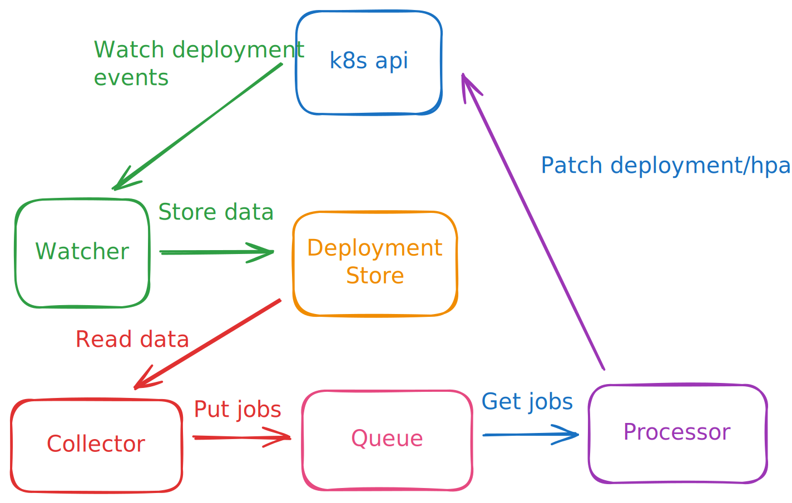

# Architecture of kube-schedule-scaler

## Components

### Watcher

**Role**: Maintains a real-time mirror of the cluster state in memory.

**Interaction**: Establishes a long-lived streaming connection with the Kubernetes API Server.

**Logic**: Listens for `ADDED`, `MODIFIED`, and `DELETED` events on Deployment objects. When an event occurs, it parses the `zalando.org/schedule-actions` annotation and updates the Deployment Store.

### Deployment Store

**Role**: Acts as the single source of truth for the application.

**Implementation**: A dictionary that maps deployment identifiers `(namespace, name)` to their parsed schedule actions.

### Collector

**Role**: Periodically evaluates the schedules against the current system time.

**Interaction**: Polls the Deployment Store once per minute.

**Logic**: Uses croniter to determine if a scaling action is due within the current minute. If a match is found, it generates a scaling job and pushes it into the Work Queue.

### Work Queue

**Role**: Decouples the decision-making (Collector) from the execution (Processor).

**Implementation**: A `asyncio.Queue` (FIFO) that ensures scaling actions are processed in order and asyncronously

### Processor

**Role**: Performs the actual scaling operations.

**Interaction**: Pulls jobs from the Work Queue and sends PATCH requests to the Kubernetes API Server.

**Logic**: Handles both Deployment scaling (replicas) and HPA scaling (min/max replicas).

## Known limitations

The cron expressions are treated as triggers only, they don't encapsule "desired state" decisions. 
If a schedule action is not triggered due to the controller being not avaliable at a given moment, the action will not be executed retroactively. 

Only 1 replica of kube-schedule-scaler should be running at a time, as there is no leader election mechanism. 
Running multiple replicas will generate duplicate scaling requests to the API server and hasn't been tested.
